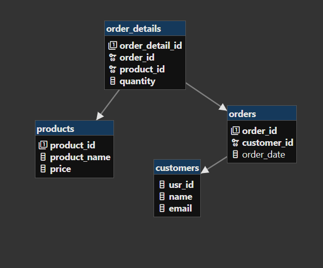

# schema description



```sql
CREATE TABLE Customers (
    USR_ID INT GENERATED BY DEFAULT AS IDENTITY (START WITH 3 INCREMENT BY 3) PRIMARY KEY,
    name VARCHAR(100) not null,
    email VARCHAR(100) not null UNIQUE
);
CREATE TABLE Products (
    product_id SERIAL PRIMARY KEY,
    product_name VARCHAR not null,
    price NUMERIC(10,2) not null
);
CREATE TABLE Orders (
    order_id SERIAL PRIMARY KEY,
    customer_id INT not null,
    order_date DATE DEFAULT CURRENT_DATE,
    FOREIGN KEY (customer_id) REFERENCES Customers(usr_id)
);
CREATE TABLE Order_Details (
    order_detail_id SERIAL PRIMARY KEY,
    order_id INT not null,
    product_id INT not null,
    quantity INT not null,
    FOREIGN KEY (order_id) REFERENCES Orders(order_id),
    FOREIGN KEY (product_id) REFERENCES Products(product_id)
);
```

# Inserting 

```sql
INSERT INTO customers (name, email) VALUES
('adi', 'adi@gmail.com'),
('chidam', 'chidam@gmail.com'),
('ram', 'ram@gmail.com'),
('shyam', 'shyam@gmail.com'),
('sita', 'sita@gmail.com');

INSERT INTO products (product_name, price) VALUES
('Laptop', 1200.00),
('Smartphone', 650.00),
('Headphones', 80.00),
('Monitor', 300.00),
('Keyboard', 45.00);

INSERT INTO orders (customer_id, order_date) VALUES
(3, '2025-04-15'),
(6, '2025-04-16'),
(9, '2025-04-16'),
(12, '2025-04-17'),
(15, '2025-04-17');

INSERT INTO order_details (order_id, product_id, quantity) VALUES
(1, 1, 1),
(2, 2, 1),
(3, 3, 2),
(4, 4, 1),
(5, 5, 3);
```

# Indexing

```sql
CREATE INDEX customer_id_index_orders_table ON orders(customer_id);
SELECT * FROM orders WHERE customer_id = 3;
EXPLAIN ANALYZE SELECT * FROM orders WHERE customer_id = 3;
```

# Triggers

```sql
CREATE OR REPLACE FUNCTION order_table()
RETURNS TRIGGER
LANGUAGE PLPGSQL
AS $$
BEGIN
  INSERT into orders (customer_id, order_date) values (3,'2025-04-18');
  RETURN NEW;
END
$$;

CREATE TRIGGER update_orders
BEFORE INSERT ON order_details
FOR EACH ROW
EXECUTE PROCEDURE order_table();

INSERT INTO order_details (order_id, product_id, quantity) VALUES
((select MAX(order_id)+1 from orders), 1, 77);
```

# Transactions

```sql
BEGIN;
INSERT INTO orders (customer_id, order_date) 
VALUES (12, '2025-04-18');

DO $$
DECLARE
    new_order_id INTEGER;
BEGIN
    SELECT MAX(order_id) INTO new_order_id FROM orders;
    INSERT INTO order_details (order_id, product_id, quantity)
    VALUES (new_order_id, 2, 5);
END$$;
COMMIT;
```