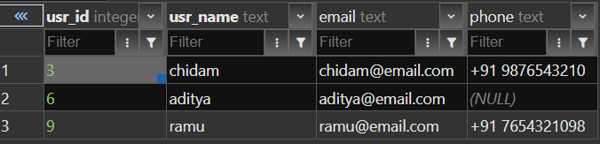
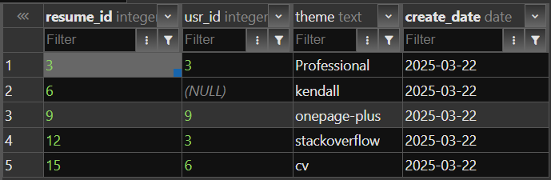
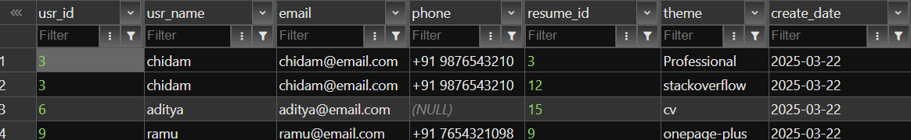
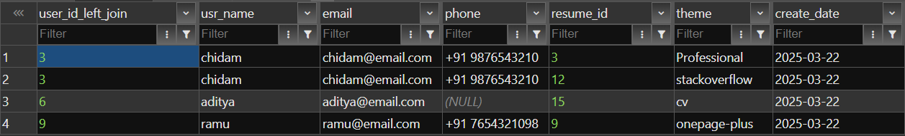
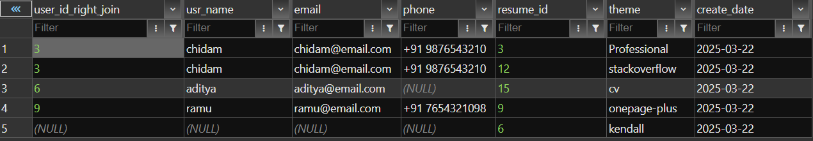
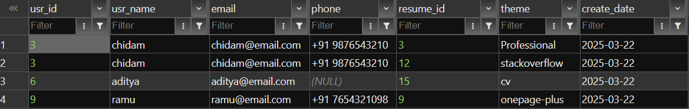
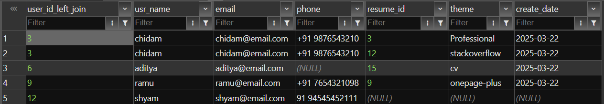

Creating the tables (for playing with joins)

```
CREATE TABLE USR (
  USR_ID INT GENERATED BY DEFAULT AS IDENTITY (START WITH 3 INCREMENT BY 3) PRIMARY KEY,
  USR_NAME TEXT NOT NULL,
  Email TEXT UNIQUE,
  Phone TEXT
);

CREATE TABLE Resume (
  RESUME_ID INT GENERATED BY DEFAULT AS IDENTITY (START WITH 3 INCREMENT BY 3),
  USR_ID INT,
  THEME TEXT,
  create_date DATE NOT NULL DEFAULT CURRENT_DATE,
  FOREIGN KEY (USR_ID) REFERENCES USR(USR_ID) ON DELETE SET NULL
);

```


Some Value insertion 

```
INSERT INTO USR (USR_NAME, Email, Phone)
VALUES
  ('chidam', 'chidam@email.com', '+91 9876543210'),
  ('aditya', 'aditya@email.com', NULL),
  ('ramu', 'ramu@email.com', '+91 7654321098');


INSERT INTO
  Resume (USR_ID, THEME)
VALUES
  (3, 'Professional'),
  (NULL, 'kendall'),
  (9, 'onepage-plus'),
  (3, 'stackoverflow'),
  (6, 'cv')
;

```



```
SELECT
  u.usr_id,
  u.usr_name,
  u.Email,
  u.phone,
  r.resume_id,
  r.theme,
  r.create_date
FROM
  USR u
  INNER JOIN Resume r ON u.usr_id = r.usr_id
ORDER BY
  u.usr_id,
  r.create_date;

SELECT
  u.usr_id as user_id_left_join,
  u.usr_name,
  u.Email,
  u.phone,
  r.resume_id,
  r.theme,
  r.create_date
FROM
  USR u
  LEFT JOIN Resume r ON u.usr_id = r.usr_id
ORDER BY
  u.usr_id,
  r.create_date; 
```

In our case left join and inner join has same result simply because every user has a corresponding resume




```
SELECT
  u.usr_id as user_id_right_join,
  u.usr_name,
  u.Email,
  u.phone,
  r.resume_id,
  r.theme,
  r.create_date
FROM
  USR u
  RIGHT JOIN Resume r ON u.usr_id = r.usr_id
ORDER BY
  u.usr_id,
  r.create_date; 
```
A normal right join 



```
SELECT
  u.usr_id as uj2,
  u.usr_name,
  u.Email,
  u.phone,
  r.resume_id,
  r.theme,
  r.create_date
FROM
  USR u
  RIGHT JOIN Resume r ON u.usr_id = r.usr_id
WHERE
  r.usr_id IS NULL 
```

A right join to find resumes with unlabeled user id


wrote a query where inner join and left join will have different result added an extra row in usr table with a user named "shyam" and didn't add any resumes in his name

Inner Join



Left Join

