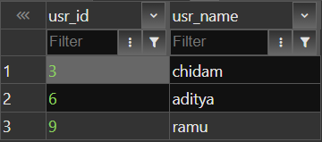

> *I am using the tables i created in "join" task*

uncorrelated subquery (inner sub query can run independently)

```
select usr_id, usr_name from usr where usr_id=(select max(usr_id) from usr);
```
(it is shyam because at the end of join task i added a row for shyam to test how inner join and left join can be different)


correlated subquery (inner sub query cannot run independently)


```
select usr_id, usr_name from usr where exists (select * from resume where usr.usr_id=resume.usr_id)
```

