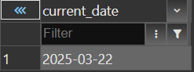
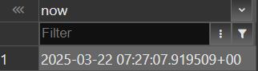
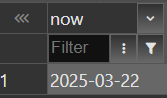
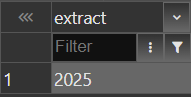
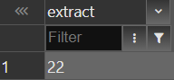
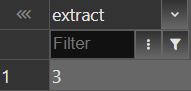
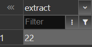
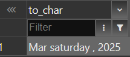
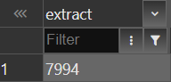

> I have already played with keeping default date in tables i have created in other tasks 

```
select current_date;
select now();
select now()::date;
select extract(year from now());
select extract(day from now());
select extract(month from now());
select extract(year from age(now(),'03-05-2003'));
select to_char(now(), 'Mon day, yyyy');
select extract(days from (now() - (date '2003-05-03')));
```

images are in the same order

















