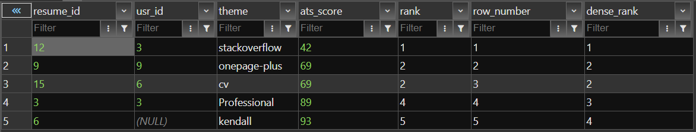
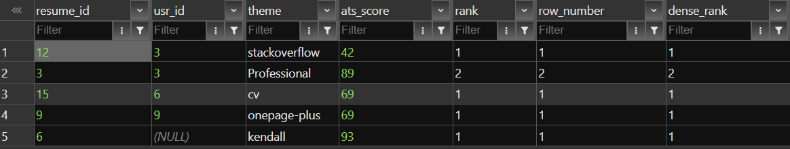
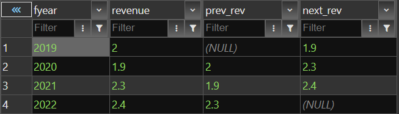

> will alter the table to include ats scores (to resume table)

```
alter table resume add column ats_score int;
```


> updating table with ats scores

```
update resume set ats_score=89 where resume_id=3;
update resume set ats_score=93 where resume_id=6;
update resume set ats_score=69 where resume_id=9;
update resume set ats_score=42 where resume_id=12;
update resume set ats_score=69 where resume_id=15;
```

> rank, row_number and dense_rank

```
select resume_id, usr_id, theme, ats_score,
rank() over(order by ats_score),
row_number() over(order by ats_score),
dense_rank() over(order by ats_score)
from resume;
```




> partition by

```
select resume_id, usr_id, theme, ats_score,
rank() over(partition by usr_id order by ats_score),
row_number() over(partition by usr_id order by ats_score),
dense_rank() over(partition by usr_id order by ats_score)
from resume;
```



> To get idea of the lead and lag window function i created a sales table details below :

```
create table sales(
    fyear int,
    revenue float
);

insert into sales (fyear,revenue) values (2019,2),(2020,1.9),(2021,2.3),(2022,2.4);
```
lead and lag query

```
select *,lag(revenue) over (order by fyear) as prev_rev,
         lead(revenue) over (order by fyear) as next_rev
         from sales order by fyear;
```



