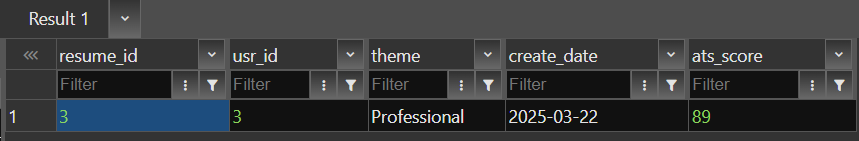

Defining procedure
```sql
CREATE OR REPLACE PROCEDURE theme_data2(
    theme_param VARCHAR
)
LANGUAGE plpgsql
AS $$
BEGIN
    insert into resume (usr_id,theme) values (3,'new');
END;
$$;
```

Defining function
```sql
CREATE OR REPLACE FUNCTION theme_function(theme_param VARCHAR)
RETURNS TABLE (
    LIKE resume
) 
AS $$ 
BEGIN
    RETURN QUERY
    SELECT *
    FROM resume r
    WHERE r.theme = theme_param;
END;
$$ LANGUAGE plpgsql;
```


Calling the procedure ( I checked it is working by looking at the resume table)
```sql
CALL theme_data2('Professional');
```


Calling the function
```sql
SELECT * FROM theme_function('Professional');
```

